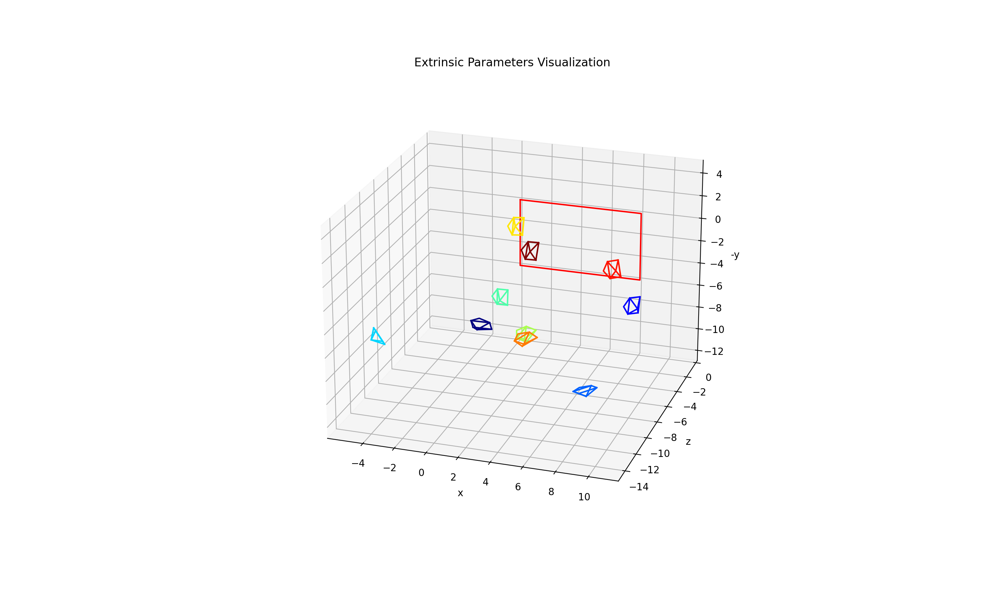
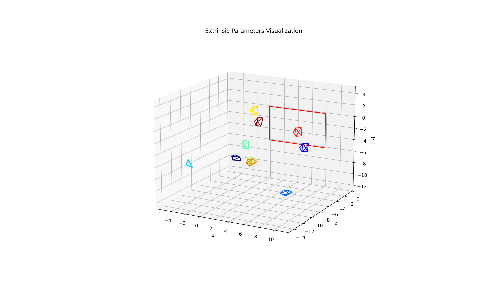
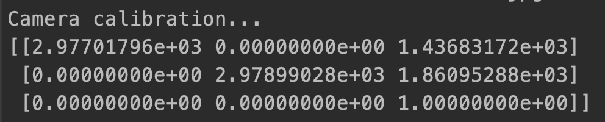
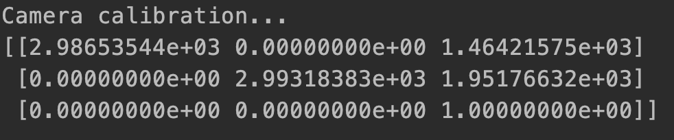

# Camera Calibration

## Contact

Any questions and suggestions are welcome!
Zhi-Yi Chin zchin31415@gmail.com

## Introduction

In this project I wrote my own version of camera calibration and compare with the result coming out of `cv2.calibrateCamera()`. The results are really similar.

## Highlights

* Time: the time it spends running is similar to using `cv2.calibrateCamera()`
* Accuracy: if use `cv2.calibrateCamera()` as the ground truth, then my results is really similar to the ground truth
* Easy: the code is easy to read and implement

## Main results
<table border="5" bordercolor="red" align="center">
    <tr>
        <th colspan="2">Comparison Table</th> 
    </tr>
    <tr>
        <th>Opencv result</th>
        <th>My result</th>
    </tr>
    <tr>
        <td>
        <td></td>
    </tr>
    <tr>
        <td>
        <td border=3 height=100 width=100>
    </tr>
</table>

## Installation

You should have conda environment with Python 3.7 or higher

`conda env create -f environment.yml`

After you have the environment ready you can verify the result by execute `camera_calibration.py` and `my_camera_calibration.py`. You must change your data path in the two program if you want to use your own data.

## License

This project is release under MIT license (see [LICENSE](../LICENSE))

