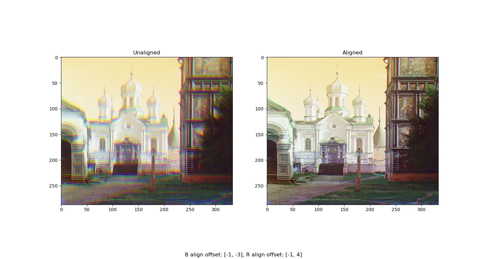
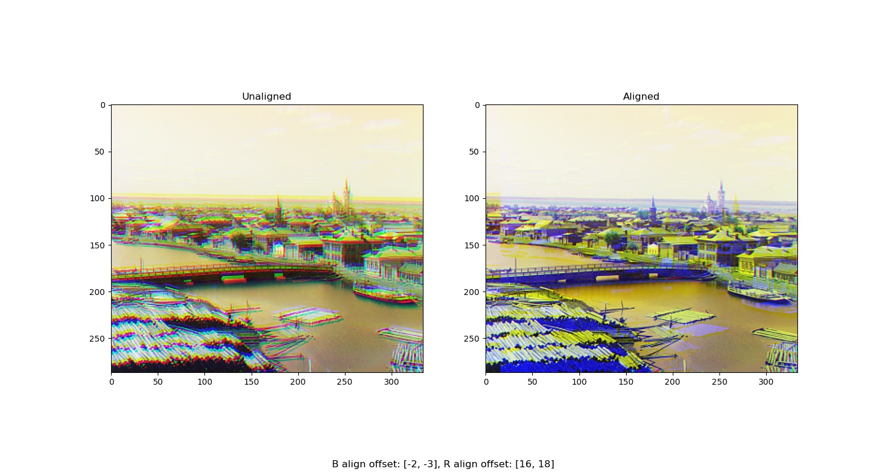

# Image Resolution

Implementation of Hybrid image -> Blend two images, one preserving only low frequency and another preserving only high frequency.
Implementation of Image of the Russian Empire -> align R,G,B channel of the images taken from Sergei Mikhailovich Prokudin-Gorskii using SSD

## Dependency

The code is tested in conda environment with Python3, the dependencies includes:

* pillow
* numpy
* matplotlib
* opencv

```
conda env create -f environment.yml
conda activate hybrid
```

## Execute the code

Change the `DATA_PATH` in `hybrid_image.py` and `russian_empire.py` if you are using your data

```
python hybrid_image.py
python russian_empire.py
```

## Results

**Hybrid Image**


**Image of the Russian Empire**





## License

This project is released under the MIT license

