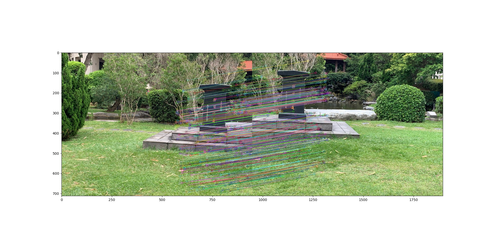
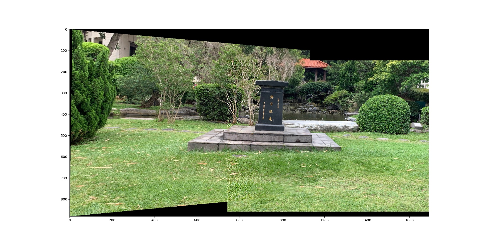

# Panoramic Stitching

Image stitching or photo stitching is the process of combining multiple photographic images with overlapping fields of view to produce a segmented panorama or high-resolution image. Commonly perform through the use of computer software, most approaches to image stitching require nearly exact overlaps between images and identical exposures to produce seamless results. However, some stitching algorithms benefit from differently exposed images by doing high-dynamic-range imaging in regions of overlap. Some digital cameras can stitch their photos too! In this project, we implement a simple panorama stitching using the computer vision techniques we have been taught in class. 

### Table of Contents

- [Set up the environment](#set-up-the-environment)
- [Reproducing the results](#reproducing-the-results)
- [Results](#results)

## Set up the environment

You should have Anaconda or Miniconda in your computer with Python3

```
conda env create -f environment.yml
conda activate panorama
```

## Reproducing the results

If you are using your own data be sure to change `DATA_PATH` in `panoramic_stitching.py`.

```
python panoramic_stitching.py
```

## Results


